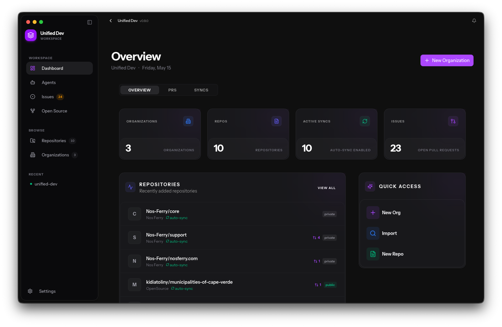
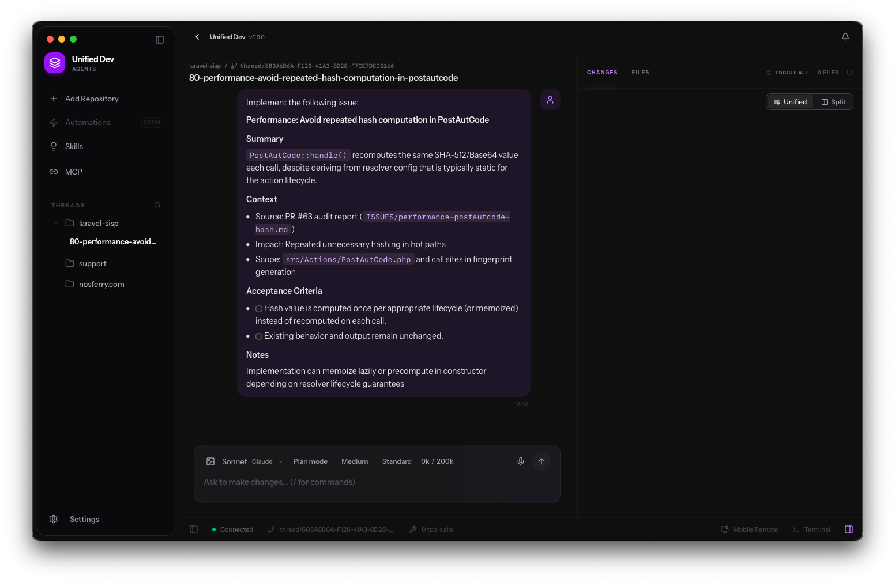
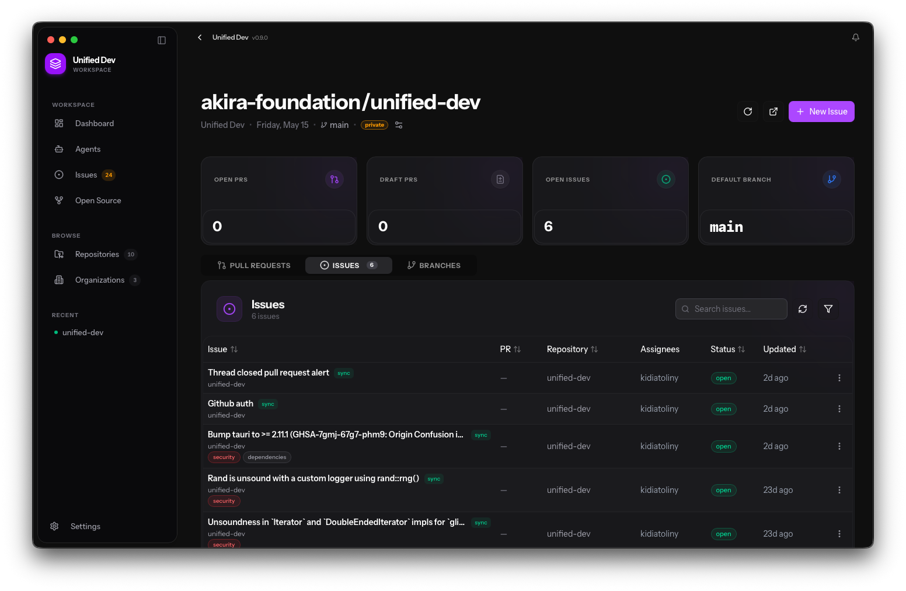
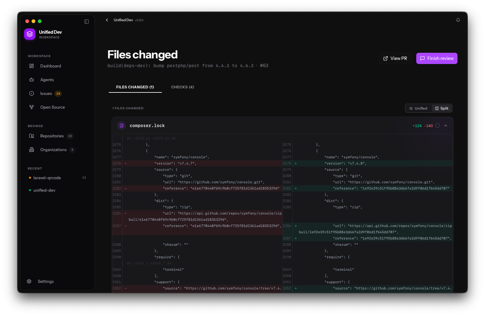
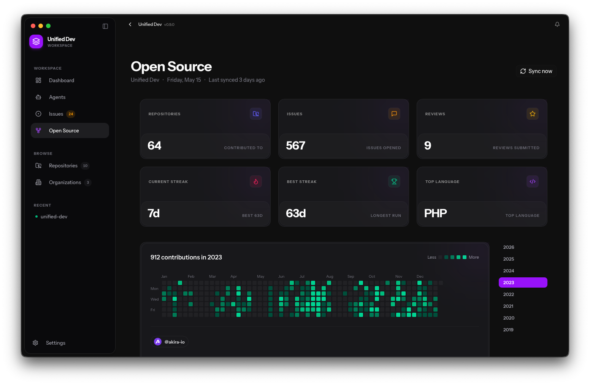

<div align="center">

# Unified Dev

**A desktop workspace for AI-assisted development.**

GitHub repos, pull requests, Linear-style issue boards, coding agents, and open-source
insights — all running locally, on your machine.

[](LICENSE)
[](https://tauri.app)

</div>

---

## What it is

Unified Dev is a native desktop app (macOS today, Windows/Linux planned) that brings
together the surfaces a developer normally juggles across a dozen browser tabs:

- **Repositories** — clone, browse, and manage local and remote repos across GitHub,
  GitLab, and Bitbucket.
- **Issues & Pull Requests** — a Linear-style board for issues, PR review, and CI status,
  synced from your connected providers.
- **Coding agents** — run Claude Code, Codex, Gemini CLI, or other AI coding agents
  against a repo from inside the app, with full thread history.
- **Autopilot** — queue up issues for an agent to work through unattended.
- **Open Source insights** — a dashboard of your public contribution activity across
  organizations.

Everything talks to a local SQLite database. Your code, your issues, and your agent
sessions stay on your machine.

## Screenshots

<table>
  <tr>
    <td></td>
    <td></td>
  </tr>
  <tr>
    <td></td>
    <td></td>
  </tr>
  <tr>
    <td colspan="2" align="center"></td>
  </tr>
</table>

## Install

Signed macOS builds are published on the [Releases](../../releases) page. The app
auto-updates itself once installed.

## Build from source

**Prerequisites**

- [Bun](https://bun.sh) 1.x
- [Rust](https://rustup.rs) (stable, 2021 edition) with the Tauri prerequisites for your
  platform — see the [Tauri docs](https://tauri.app/start/prerequisites/)
- macOS (Windows/Linux support is scaffolded in CI but not yet enabled)

**Steps**

```bash
git clone https://github.com/akira-foundation/unified-dev.git
cd unified-dev

bun install
cp .env.example .env   # fill in the values you need — see below

bun run tauri dev      # run the app in development mode
bun run tauri build    # build a distributable
```

**Environment variables** (`.env`)

| Variable | Purpose |
|---|---|
| `ANTHROPIC_API_KEY`, `OPENAI_API_KEY`, `OLLAMA_HOST` | Optional — lets the bundled coding-agent integrations authenticate without prompting on first use. |
| `AKIRA_BILLING_URL`, `AKIRA_BILLING_SECRET` | Backend used for GitHub OAuth token exchange and anonymous usage counting. Not required to build; the app degrades gracefully without them. |
| `GITHUB_CLIENT_ID` | GitHub OAuth App client ID, if you're running against your own OAuth app. |

None of these are required to build the app — they only affect what works at runtime
without further configuration.

## Development

- `bun run dev` — Vite dev server for the frontend only (no Tauri shell)
- `bun run tauri dev` — full app, frontend + Rust backend, with hot reload
- `bun run build` — typecheck + production frontend build
- `bun run test` — frontend unit tests (Vitest)
- `cargo test` (from `src-tauri/`) — Rust backend tests

See [CONTRIBUTING.md](CONTRIBUTING.md) for the full workflow, branch conventions, and PR
process.

## Architecture

- **Frontend**: React + TypeScript + Vite, in `src/`
- **Backend**: Rust + [Tauri](https://tauri.app), in `src-tauri/`. SQLite (SQLCipher-encrypted,
  one database file per logged-in account) via `sqlx`.
- **Worker**: a small Cloudflare Worker (`worker/`) that proxies GitHub OAuth token
  exchange and anonymous usage counting — it never sees your code or credentials.

## License

Unified Dev is licensed under the [GNU Affero General Public License v3.0](LICENSE).

## Security

Found a vulnerability? Please see [SECURITY.md](SECURITY.md) for how to report it
privately.
